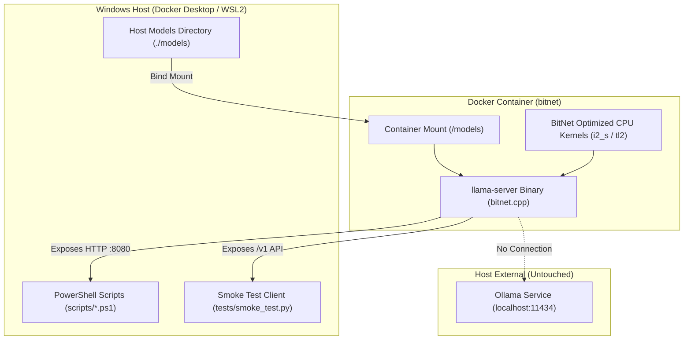

# Component Dependency Map

```mermaid
graph TD
    subgraph Host["Windows Host (Docker Desktop / WSL2)"]
        PS["PowerShell Scripts (scripts/*.ps1)"]
        Test["Smoke Test Client (tests/smoke_test.py)"]
        ModelsHost["Host Models Directory (./models)"]
    end

    subgraph DockerEnv["Docker Container (bitnet)"]
        ModelsMount["Container Mount (/models)"]
        ServerBin["llama-server Binary (bitnet.cpp)"]
        Kernels["BitNet Optimized CPU Kernels (i2_s / tl2)"]
    end

    subgraph ExternalServices["Host External (Untouched)"]
        Ollama["Ollama Service (localhost:11434)"]
    end

    ModelsHost -->|Bind Mount| ModelsMount
    ModelsMount --> ServerBin
    Kernels --> ServerBin
    ServerBin -->|Exposes HTTP :8080| PS
    ServerBin -->|Exposes /v1 API| Test

    %% Isolation Guarantee
    ServerBin -.->|No Connection| Ollama
```
